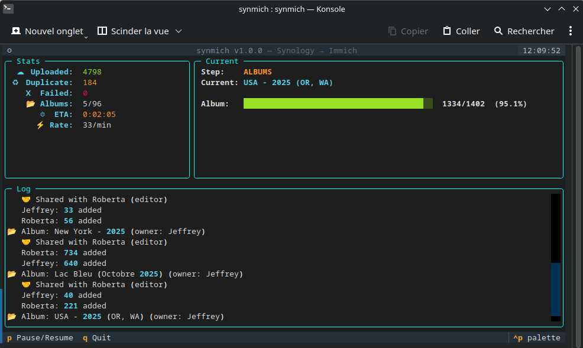

<h1 align="center">synmich</h1>

<p align="center">
  <b>Synology Photos → Immich migration tool</b><br>
  <i>The shared-albums-aware migration tool the community has been waiting for.</i>
</p>
<p align="center">
  
</p>
<p align="center">
  <a href="https://github.com/schnyder/synmich/actions"></a>
  <a href="https://pypi.org/project/synmich/"></a>
  <a href="LICENSE"></a>
  <a href="https://github.com/schnyder/synmich/issues"></a>
</p>

---

## Why synmich?

Existing migration tools (`immich-go`, `photomigrator`, etc.) handle simple cases well but **fall short with multi-user Synology setups**:

| Feature                                        | immich-go | synmich    |
| ---------------------------------------------- | :-------: | :--------: |
| Single-user albums                             |     ✅    |     ✅     |
| **Shared albums** between Synology users       |     ❌    |     ✅     |
| **Correct owner** preservation                 |     ❌    |     ✅     |
| **Shared Space** (`owner_user_id: 0`) photos   |     ❌    |     ✅     |
| Multi-user Synology Photos accounts            |  Partial  |     ✅     |
| Synology album permissions (upload/view)       |     ❌    |     ✅     |
| Live progress dashboard (TUI)                  |     ❌    |     ✅     |
| Resume after interruption                      |  Limited  |     ✅     |
| Parallel + sequential execution modes          |     ❌    |     ✅     |

If you have a Synology NAS with multiple users sharing albums (couples, families), and you want to move to Immich without losing your shared albums, **synmich is for you**.

## Quick start

```bash
# Install
pip install synmich

# Configure (interactive wizard)
synmich init

# Run migration
synmich migrate
```

That's it. Live dashboard, hotkeys for pause/resume, resume on Ctrl+C.

## Safety

**synmich is read-only on your Synology NAS.** It only calls the Synology Photos API endpoints that read data (`login`, `me`, `list`, `download`). It never writes, modifies, or deletes anything on your NAS. The Synology Photos library remains 100% intact during and after migration.

The `delete_after_upload` option **only** removes the temporary files that synmich downloads to your local computer (in `./synmich_backup/` by default). This is unrelated to your NAS files.

## Features

- **Smart shared albums** — Albums shared on Synology are recreated as shared albums in Immich, with the **right owner** and the **right permissions** (`upload` → editor, `view` → viewer).
- **Shared Space support** — Photos in Synology's Shared Space (`owner_user_id: 0`) are migrated and attributed to a configurable owner.
- **Multi-user, N users** — Not limited to 2 users. Works for 2, 4, 10 users with cross-shared albums.
- **Timeline import** — Migrates the full Synology Photos timeline of each user, not just album content.
- **Auto-detect users** — If you provide DSM admin credentials, the wizard lists all users automatically.
- **Live TUI dashboard** — Progress bars, stats, scrollable logs, pause/resume hotkeys.
- **Robust resume** — Checkpoint after every 25 uploads. Stop anytime with `Q` or `Ctrl+C`, resume with `synmich migrate`.
- **Parallel or sequential** — Choose between fast parallel mode (4 workers default) or safe sequential mode for low-power NAS.
- **Dedup by checksum** — Same photo in multiple albums = uploaded once.

## Commands

```bash
synmich init                  # Interactive setup wizard
synmich migrate               # Run migration (with TUI)
synmich migrate --no-tui      # No dashboard (for scripts/cron)
synmich migrate --albums-only # Skip timeline
synmich migrate --reset       # Reset checkpoint and start over
synmich migrate --sequential  # 1 worker (safer for small NAS)
synmich migrate --workers 8   # Custom worker count

synmich users                 # List configured users + connection status
synmich albums                # List detected albums (Synology side)
synmich verify                # Verify Immich state after migration

synmich stats                 # Show checkpoint statistics
synmich logs -n 100           # Show last 100 log lines
synmich config                # Show config paths
synmich reset                 # Reset checkpoint
```

## Configuration

After `synmich init`, your config lives at `~/.config/synmich/config.yaml`:

```yaml
synology:
  url: https://192.168.0.2:5001
  verify_ssl: false

immich:
  url: http://192.168.0.2:2283

users:
  - name: Jeffrey
    syno_username: jeffrey
    syno_password: ********
    immich_api_key: ********
  - name: Roberta
    syno_username: roberta
    syno_password: ********
    immich_api_key: ********

migration:
  include_albums: true
  include_shared_albums: true
  shared_albums_mode: link        # link | duplicate | ignore
  include_timeline: true
  include_shared_space: true
  shared_space_owner: Jeffrey
  share_role: editor              # editor | viewer

execution:
  mode: parallel                  # parallel | sequential
  workers: 4
  max_retries: 5
  retry_backoff_seconds: 3
  delete_after_upload: true
  verbose: false

filters:
  include_albums_regex: ""
  exclude_albums_regex: ""
  include_videos: true
  max_file_size_mb: 0             # 0 = no limit

paths:
  work_dir: ./synmich_backup
```

## How it works

```
┌─────────────┐                ┌──────────────┐
│  Synology   │                │    Immich    │
│   Photos    │                │              │
└──────┬──────┘                └──────▲───────┘
       │                              │
       │  1. List albums & permissions│
       │  2. List items per user      │
       │  3. Identify true album owner│
       │  4. Download per uploader    │
       │                              │
       └──────────┐    ┌──────────────┘
                  │    │
              ┌───▼────▼────┐
              │   synmich   │
              │             │
              │ • Match by  │
              │   passphrase│
              │ • Map owner │
              │ • Share with│
              │   permissions│
              │ • Add by    │
              │   uploader  │
              └─────────────┘
```

The key insight that other tools miss: when you list albums via Synology's API, **each shared album returns a `passphrase` field that is identical across users who see it**. This is the only reliable key to deduplicate shared albums when migrating from multiple Synology accounts.

The `sharing_info.owner.id` field then tells synmich who originally created the album, so it's created under the right Immich account. The `permission[]` list tells who to share with and at which role.

## Troubleshooting

### Empty file errors during download

Synology sometimes returns empty responses under heavy parallel load. synmich automatically retries and logs these. If you see many: switch to sequential mode (`synmich migrate --sequential`) or lower workers (`synmich migrate --workers 2`).

### Photos in trash after a failed run

Immich keeps deleted assets in trash. After a wipe to start fresh, empty the trash:

```bash
curl -X POST "http://YOUR_IMMICH/api/trash/empty" -H "x-api-key: YOUR_KEY"
```

### "no_permission" when adding photos to a shared album

synmich automatically adds photos to albums using each uploader's own API key, so this shouldn't happen. If it does, check that the Synology album was shared with `upload` permission (not just `view`).

### Photos counted in checkpoint but missing from Immich album

If the checkpoint shows more uploaded items than what's actually in the Immich album, the issue is usually:
- **Race condition or filename collision** (fixed in v1.0.0). If running an older version, update synmich.
- **Wrong owner**: a photo was uploaded under the wrong user's account. Verify with `synmich verify` and re-run `synmich migrate --reset` if needed.

### Live Photos (iPhone HEIC + MOV)

iPhone Live Photos on Synology are stored as a HEIC photo with an associated mini-video. synmich migrates the HEIC part as a regular photo. The "live" animated component is not migrated — this is a limitation of the Synology download API which only returns the HEIC file.

### Synology API changes between DSM versions

synmich is tested on DSM 7.2+. Older DSM versions may use different API parameter names. If `synmich users` fails, check `~/.config/synmich/migration.log` for the exact API error.

### Restarting from scratch

If something went wrong and you want to clean everything:

```bash
# 1. Stop synmich (Q in dashboard, or Ctrl+C)
# 2. Wipe Immich (each user)
curl -X POST "http://IMMICH/api/trash/empty" -H "x-api-key: KEY"
# (Manually delete albums and assets via Immich UI first if needed)

# 3. Reset synmich state
rm -rf ~/.config/synmich/checkpoint.json
rm -rf ~/.config/synmich/migration.log
rm -rf ~/synmich_backup

# 4. Run again
synmich migrate
```

### Test without uploading anything

Use `--dry-run` to see what synmich would do without actually downloading or uploading:

```bash
synmich migrate --dry-run --no-tui
```

This lists all albums and items that would be processed, without touching Immich or downloading any photos. Useful for validating your config before a long migration.

## Contributing

Contributions welcome! See [CONTRIBUTING.md](CONTRIBUTING.md).

## License

MIT — see [LICENSE](LICENSE).

## Acknowledgements

- The [Immich](https://immich.app/) team for an amazing open-source photo platform.
- The [Synology Photos API community](https://github.com/zeichensatz/SynologyPhotosAPI) for reverse-engineering work.
