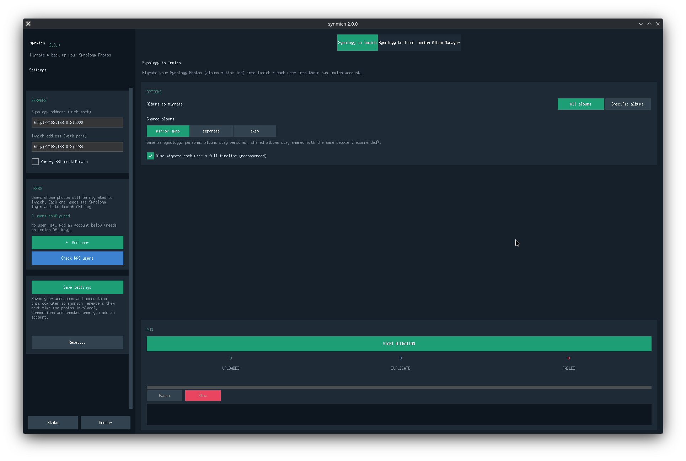
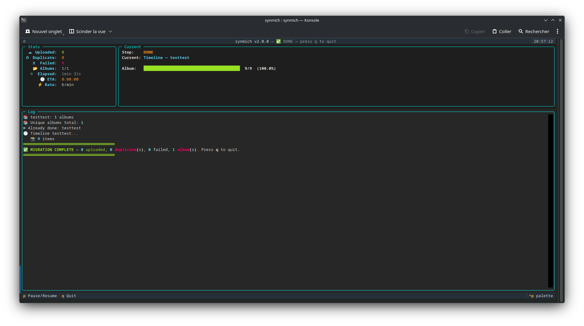
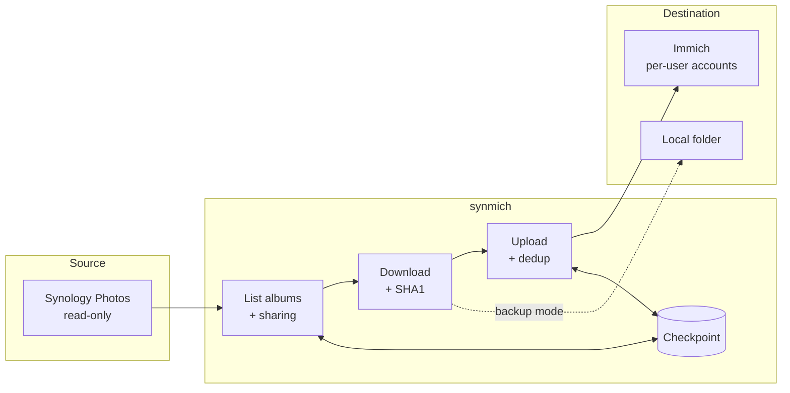

<div align="center">

```
   ███████╗██╗   ██╗███╗   ██╗███╗   ███╗██╗ ██████╗██╗  ██╗
   ██╔════╝╚██╗ ██╔╝████╗  ██║████╗ ████║██║██╔════╝██║  ██║
   ███████╗ ╚████╔╝ ██╔██╗ ██║██╔████╔██║██║██║     ███████║
   ╚════██║  ╚██╔╝  ██║╚██╗██║██║╚██╔╝██║██║██║     ██╔══██║
   ███████║   ██║   ██║ ╚████║██║ ╚═╝ ██║██║╚██████╗██║  ██║
   ╚══════╝   ╚═╝   ╚═╝  ╚═══╝╚═╝     ╚═╝╚═╝ ╚═════╝╚═╝  ╚═╝
```

**Migrate Synology Photos to Immich, properly — albums, sharing and all.**




</div>

---

## Why synmich

Moving off Synology Photos usually means losing the parts that matter: your **albums**, **who they were shared with**, and the **per-user libraries**. Most tools dump a flat pile of files into one account and call it a day.

synmich migrates **each Synology user into their own Immich account**, recreates their albums, and preserves shared albums the way Synology had them — mirror the sharing, give everyone their own copy, or skip sharing entirely. Photos are deduplicated by **SHA1**, the run is **resumable**, and your **Synology NAS is never modified** (read-only). And it ships with a **real graphical app**, not just a CLI.

> Tested in production: **67,844 photos** migrated successfully, every asset validated via SHA1 checksum.

| | immich-go | **synmich** |
| --- | :---: | :---: |
| Single-user albums | ✅ | ✅ |
| **Shared albums** between Synology users | ❌ | ✅ |
| Correct **owner** preservation | ❌ | ✅ |
| **Shared Space** photos (`owner_user_id: 0`) | ❌ | ✅ |
| Multi-user Synology accounts | partial | ✅ |
| Synology album permissions (upload/view) | ❌ | ✅ |
| **Graphical app** | ❌ | ✅ |
| Resume after interruption | limited | ✅ |

---

## The app — start here 👈

The graphical app is the easiest way to use synmich. One window, dark theme, no command line.

```bash
pip install -e . && pip install customtkinter
synmich gui
```

<div align="center">

</div>

**Three operations, as tabs (top-right):**

| Tab | What it does |
| --- | --- |
| **Synology to Immich** | Migrate your Synology Photos (albums + timeline) into Immich, each user into their own Immich account |
| **Synology to local** | Download your Synology albums to a folder on this computer (no Immich needed) |
| **Immich Album Manager** | Browse and rename your Immich albums, grouped per user |

**Left panel — Settings (always there):**
- **Servers**: your Synology and Immich addresses (an IP with a port is fine, e.g. `192.168.0.2:5000`).
- **Users / accounts**: managed per tab — *Synology to Immich* needs a Synology login **+** an Immich API key per user; *Synology to local* needs only the Synology login. A **Check NAS users** button lists the real users on your NAS (system accounts hidden).
- **Stats / Doctor** at the bottom, and a scoped **Reset…** (progress / 2FA devices / configuration / everything — *never your photos*).

**Running a migration:**
1. Fill in the **Synology** and **Immich** addresses (left panel), then **Add user** (it tests the connection on the spot; 2FA codes are remembered).
2. Pick the options: **All albums** or **Specific albums**, the **shared-albums** mode (`mirror-syno` = keep Synology's sharing, `separate` = a copy per user, `skip`), and whether to include each user's **full timeline**.
3. In *Specific albums*, the list is split into **one sub-tab per user**, with **Check all / Uncheck all**, a live count, and a *shared with …* badge on shared albums.
4. Hit **START MIGRATION** and watch the live counters (uploaded / duplicate / failed), the progress bar and the log. **Pause** or **Stop** any time — it's resumable.

> Tip: the window opens at a comfortable size and adapts to smaller screens. Everything is read-only on the Synology side.

---

## Quick start

```bash
git clone https://github.com/t3ksin/synmich.git
cd synmich
pip install -e . && pip install customtkinter   # customtkinter = the GUI
synmich gui                                       # the app (recommended)
# — or —
synmich init                                      # terminal wizard, then migrate
```

---

## Features

- ✅ **Graphical app** (`synmich gui`) — dark, beginner-friendly, per-user album tabs, live progress, Doctor & Reset built in
- ✅ **Multi-user migration** — each Synology user goes to their own Immich account
- ✅ **Shared albums, your way** — `mirror-syno` (same sharing), `separate` (a copy per user), or `skip`
- ✅ **Albums + timeline** — migrate the full library or just the albums
- ✅ **Local backup** — download Synology albums to a folder (Synology → local)
- ✅ **Resumable** — a checkpoint tracks progress; re-run any time without re-uploading
- ✅ **SHA1 deduplication** — already-present photos are detected and skipped
- ✅ **2FA support** — device tokens are remembered so you enter the code once
- ✅ **Doctor** — diagnoses servers, accounts, disk space and config in one go
- ✅ **Safe by design** — the Synology NAS is only ever read, never written

---

## Installation

```bash
git clone https://github.com/t3ksin/synmich.git
cd synmich
pip install -e .
pip install customtkinter      # only needed for `synmich gui`
```

**Requirements:** Python 3.9+, a reachable Synology Photos instance, and an Immich server with one API key per user.

---

## Configuration

The wizard writes the config for you (and chains straight into a first migration):

```bash
synmich init
```

Or edit `~/.config/synmich/config.yaml` by hand:

```yaml
synology:
  url: http://192.168.0.2:5000     # IP or host, with port
  verify_ssl: false

immich:
  url: http://192.168.0.2:2283     # IP or host, with port

users:
  - name: jeffrey
    syno_username: jeffrey
    syno_password: "********"
    immich_api_key: "paste-jeffreys-immich-api-key"
  - name: roberta
    syno_username: roberta
    syno_password: "********"
    immich_api_key: "paste-robertas-immich-api-key"

migration:
  include_albums: true
  include_timeline: true
  shared_albums_mode: link         # link | duplicate | ignore
```

> Config and checkpoint files stay on your machine and are git-ignored — no credentials ever leave your computer.

---

## CLI (for power users)

Prefer the terminal, or scripting/cron? Everything is available on the command line too, with a live dashboard:

<div align="center">

</div>

```bash
synmich --help
```

| Command | What it does |
| --- | --- |
| `synmich gui` | Launch the graphical app |
| `synmich init` | Setup wizard, then run the first migration |
| `synmich migrate` | Run the migration (resumable, live dashboard) |
| `synmich migrate --select` | Pick albums in a per-user picker (one tab per user) |
| `synmich doctor` | Full diagnostic: servers, accounts, disk, config |
| `synmich stats` | Checkpoint statistics |
| `synmich users` | List configured users and their status |
| `synmich albums` | List the albums detected on Synology |
| `synmich reset` | Reset the migration checkpoint |
| `synmich config` | Show config paths and validate |

```bash
synmich migrate                 # migrate everything (albums + timeline)
synmich migrate --albums-only   # albums only, skip the timeline
synmich migrate --select        # choose albums, grouped by user
synmich migrate --dry-run       # simulate: nothing downloaded or uploaded
```

> Choosing albums works in both the GUI and the CLI (`--select`). Without it, the CLI migrates everything, optionally filtered by `filters.include_albums_regex` in the config.

---

## Architecture



For each user, synmich logs into Synology, enumerates albums and their sharing, downloads originals to a temp area, checksums them, and uploads only what Immich doesn't already have — recording every step in a checkpoint so an interrupted run picks up exactly where it stopped.

---

## Real-world results

synmich was built to move a real, messy, decade-old library and is validated against it:

- **67,844 photos** migrated successfully
- Every asset **validated via SHA1** before being counted as done
- **0 photos modified or deleted** on the Synology side
- Shared albums preserved with their original owner and members

---

## Roadmap

- [ ] Google Takeout import (bring legacy Google Photos in alongside Synology)
- [ ] Scheduled / incremental sync
- [ ] One-click packaged builds of the GUI (no Python needed)
- [ ] Selective per-album backup presets

Shipped in 2.0: the **GUI**, **local backup**, **shared-album modes**, **2FA device tokens** and a scoped **Reset**.

---

## Contributing

```bash
git clone https://github.com/t3ksin/synmich.git
cd synmich
python -m venv .venv && source .venv/bin/activate
pip install -e .
pip install customtkinter

synmich doctor      # sanity-check your setup
synmich gui         # run the app from source
```

The codebase splits cleanly into `core/` (Synology + Immich clients, the migrator), `ui/` (CLI theming, wizard, album picker), `commands/` (CLI subcommands) and `gui/` (the CustomTkinter app). PRs and issues welcome.

---

## License

[MIT](LICENSE) © synmich contributors
